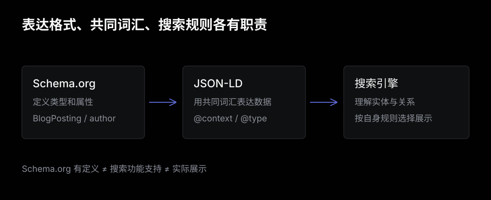
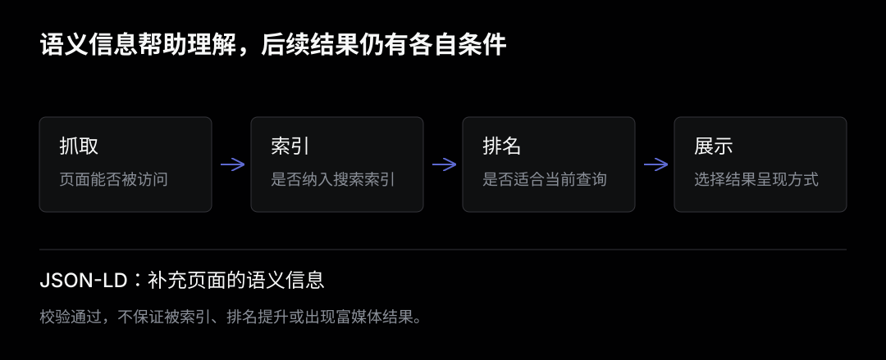

网页里明明已经有标题、作者和日期，为什么还要再写一段 JSON-LD？

因为页面展示的是排版后的内容，而搜索引擎还需要判断这些内容分别代表什么。一个日期可能是发布时间，也可能只是正文里的例子；一个名字可能是作者，也可能是文章提到的人。JSON-LD 可以把这些关系明确表达出来。

它在 SEO 中的价值，是帮助搜索引擎理解页面，并在符合条件时支持更丰富的搜索展示。加上这段代码，不代表文章就会排到前面，也不保证搜索结果一定出现图片或其他增强效果。

## 从一篇博客文章开始

假设页面里有这样的内容：

```html
<article>
  <h1>理解 Git worktree</h1>
  <p>作者：小林</p>
  <time datetime="2026-10-06T09:00:00+08:00">2026 年 10 月 6 日</time>
  <p>Git worktree 允许同一个仓库拥有多份工作目录。</p>
</article>
```

人很容易读懂它。搜索引擎也能从 HTML 和正文推断含义，但仍然需要识别：这是一篇文章，标题是什么，谁写的，什么时间发布。

JSON-LD 把这些信息整理成明确的数据：

```html
<script type="application/ld+json">
{
  "@context": "https://schema.org",
  "@type": "BlogPosting",
  "headline": "理解 Git worktree",
  "author": {
    "@type": "Person",
    "name": "小林"
  },
  "datePublished": "2026-10-06T09:00:00+08:00"
}
</script>
```

这段脚本通常放在 HTML 的 `head` 或 `body` 中。浏览器将它作为数据块处理，不会像普通 JavaScript 一样执行，也不会把它直接显示在页面上。

这里描述的事实，应该和读者看到的文章一致。JSON-LD 是对已有内容的结构化表达，不能用来填入页面上不存在的作者、评分或商品信息。

## JSON-LD、Schema.org 和 SEO 分别是什么

这三个概念经常一起出现，但解决的问题不同。

| 概念 | 解决的问题 | 在例子中的对应项 |
| --- | --- | --- |
| JSON | 怎样表达字段和值 | 对象、数组、字符串 |
| JSON-LD | 怎样明确数据的语义和实体关系 | `@context`、`@type`、`@id` |
| Schema.org | 用哪些共同词汇描述现实中的事物 | `BlogPosting`、`Person`、`headline` |
| SEO | 怎样帮助内容被发现、理解和呈现 | 内容、抓取、索引、搜索展示等工作 |

JSON-LD 的全称是 JSON for Linked Data，即用 JSON 表达关联数据。它是一种通用数据格式，应用范围不限于搜索引擎。

Schema.org 则提供共同的类型和属性。大家都用 `Person` 表示人、用 `author` 表示作者关系，机器就更容易把不同网站的数据放在同一套语义下理解。

SEO 是更大的工作范围。结构化数据只是其中一部分，正文质量、页面能否访问、链接结构和索引状态都需要单独处理。



## 读懂几个关键字段

### @context：字段的含义从哪里来

```json
"@context": "https://schema.org"
```

它把字段名关联到词汇定义。例如在这个上下文中，`author` 是 Schema.org 定义的作者属性。

普通 JSON 中也能写 `author`，但它只是应用自行约定的字段名。JSON-LD 的上下文让这个名称具有可以跨系统理解的含义。

### @type：这里描述的是什么

```json
"@type": "BlogPosting"
```

`BlogPosting` 表示博客文章，是 `Article` 的一种更具体的类型。新闻报道可以使用 `NewsArticle`；作者可以使用 `Person`。

类型应该符合内容。技术教程不会因为改成 `Product` 就获得商品展示资格。

### @id：实体的标识

```json
{
  "@type": "Person",
  "@id": "https://example.com/about/#author",
  "name": "小林"
}
```

`@id` 用来标识一个实体。不同文章引用相同的作者标识，可以明确表达“这些文章的作者是同一个人”。

`@id` 与 `url` 的用途不同：前者标识实体，后者通常指向有关这个实体的网页。上面的 `#author` 是实体标识的一部分，不要求存在一张独立的作者文件。

简单博客可以先使用嵌套对象。只有需要复用作者、网站或组织实体时，再考虑通过 `@id` 引用，或用 `@graph` 组织多个节点。

## 它对 SEO 能起什么作用

搜索引擎需要完成多个环节：发现页面、抓取内容、决定是否索引，再根据查询选择结果和展示方式。JSON-LD 主要补充页面的语义信息。



### 更明确地理解文章信息

文章结构化数据可以明确描述标题、作者、发布日期和图片，帮助搜索引擎理解这些信息及其关系。

例如，`datePublished` 表示首次发布时间，`dateModified` 表示最近修改时间。把它们分开，比只给出一个含义不明的日期更清楚。

### 支持符合条件的搜索展示

一些搜索功能会使用结构化数据，例如商品价格、菜谱信息和面包屑。对于文章，结构化数据可以帮助搜索引擎处理标题、图片和日期。

但要区分三个层次：

1. 数据符合 JSON-LD 和 Schema.org 的定义。
2. 数据符合搜索引擎支持的功能及其具体要求。
3. 搜索引擎在某次查询中实际采用了这种展示。

第一层成立，不代表后两层一定成立。Schema.org 定义的类型比搜索引擎支持的增强展示更广；即使满足展示条件，实际呈现也由搜索引擎决定。

本文的搜索功能和验证方法主要以 Google 为例，其他搜索引擎的支持范围需要分别确认。

### 不承诺排名和点击率提升

不能把添加 JSON-LD 当成提高排名的保证。它也不能让被访问限制挡住的页面自动被抓取，或让没有实质内容的页面变得更有价值。

更丰富的展示可能影响用户是否点击，但这是需要观察的数据结果。不能从“校验通过”直接推导出“流量增加”。

## 博客可以怎样接入

对于个人博客，先准确描述文章本身，比堆叠大量类型更有用。

下面是扩展后的示例。域名、作者、日期和图片都是演示数据，使用前必须替换为页面的真实信息：

```html
<script type="application/ld+json">
{
  "@context": "https://schema.org",
  "@type": "BlogPosting",
  "@id": "https://example.com/posts/git-worktree/#article",
  "url": "https://example.com/posts/git-worktree/",
  "headline": "理解 Git worktree",
  "description": "解释 Git worktree 的结构以及适用场景。",
  "image": ["https://example.com/posts/git-worktree/cover.jpg"],
  "datePublished": "2026-10-06T09:00:00+08:00",
  "dateModified": "2026-10-06T09:00:00+08:00",
  "author": {
    "@type": "Person",
    "@id": "https://example.com/about/#author",
    "name": "小林",
    "url": "https://example.com/about/"
  },
  "mainEntityOfPage": {
    "@type": "WebPage",
    "@id": "https://example.com/posts/git-worktree/"
  }
}
</script>
```

这里的 `mainEntityOfPage` 表达“这篇文章是这个网页的主要实体”。它并不代替 HTML 中的 canonical 链接。

接入时重点检查：

- 标题、作者和日期与页面展示一致。
- URL 使用完整的线上地址，不能残留本地开发域名。
- 图片真实存在，与文章相关，并且允许搜索引擎访问。
- 日期包含时区，例如北京时间的 `+08:00`。
- 修改时间反映实际内容更新，不随每次构建自动刷新。

没有合适的图片时，不要编造一个图片地址。示例也不是所有网站都要逐项照抄的必填清单；应按目标功能的最新文档选择适用属性。

### Hugo 中先检查主题已有输出

Hugo 的 Markdown front matter 并不是搜索引擎直接读取的 JSON-LD。它提供标题、日期、描述等数据，再由模板生成最终 HTML。

因此，添加新模板之前，先打开生成后的文章页面，搜索：

```text
application/ld+json
```

很多主题已经提供结构化数据。例如本博客使用的 Blowfish 版本，在 `layouts/partials/schema.html` 中生成相关数据，并由 `head.html` 引入；文章页已有 `Article` 标记。

已有 `Article` 不代表必须再添加一份 `BlogPosting`。应先检查现有字段是否准确，再决定是否需要补充。一个页面可以描述文章、作者和面包屑等多个实体，但同一篇文章的多份标记如果给出不同作者或日期，会增加维护成本。

如果需要自定义，优先使用 Hugo 的项目模板覆盖机制，并通过 JSON 序列化生成数据，避免手工拼接时被标题中的引号或换行破坏格式。

## 怎样验证是否生效

验证要逐层进行。代码合法、功能支持和实际展示，是三个不同问题。

| 检查方式 | 回答的问题 | 不能据此保证什么 |
| --- | --- | --- |
| JSON 解析 | 有没有语法错误 | 类型和属性是否合理 |
| Schema Markup Validator | Schema.org 标记是否合理 | Google 是否支持对应展示 |
| Rich Results Test | Google 支持的富媒体结果标记能否被识别，是否有技术问题 | 一定被索引、一定展示 |
| Search Console URL 检查 | Google 能否访问页面，抓取或索引状态如何 | 固定排名或展示样式 |
| Search Console 效果报告 | 实际展示、点击、点击率和平均排名如何变化 | 变化一定由 JSON-LD 引起 |

本地阶段先检查生成的 HTML，再把标记粘贴到校验工具。上线之后，使用真实 URL 测试，检查网页和图片是否可访问，以及 Google 实际看到的内容。

观察效果时，应比较同一批页面在足够长时间内的数据，并考虑查询、排名、季节和内容更新的变化。只看上线后一两天的点击量，很难判断结构化数据有没有产生影响。

GA4 更适合观察用户进入网站后的访问行为；Google 搜索中的展示和点击，应在 Search Console 中看。

## 什么时候先不用增加复杂度

页面还无法正常访问、标题含糊、正文不完整时，先解决这些基础问题。JSON-LD 不会补齐内容，也不能代替索引排查。

如果主题已经输出准确的文章信息，没有特定的展示需求，就先维护好现有标记。只有内容确实包含商品、菜谱、视频等实体，并且目标搜索功能适用时，再扩展对应类型。

判断是否要加一个字段或类型，可以先问：页面里是否有这个事实？它是否帮助明确内容关系？是否有相应的搜索功能或数据消费方？谁来保证它以后仍然准确？

对个人博客，优先级可以是：写清楚内容，让页面可访问，保持标题和 URL 稳定，再准确维护文章结构化数据。JSON-LD 的价值来自真实、一致、可维护的信息。

## 参考

- [W3C：JSON-LD 1.1](https://www.w3.org/TR/json-ld11/)
- [Schema.org：BlogPosting](https://schema.org/BlogPosting)
- [Google：结构化数据介绍](https://developers.google.com/search/docs/appearance/structured-data/intro-structured-data)
- [Google：结构化数据通用指南](https://developers.google.com/search/docs/appearance/structured-data/sd-policies)
- [Google：Article 结构化数据](https://developers.google.com/search/docs/appearance/structured-data/article)
- [Google：SEO 入门指南](https://developers.google.com/search/docs/fundamentals/seo-starter-guide)
- [Schema Markup Validator](https://validator.schema.org/)
- [Google Rich Results Test](https://search.google.com/test/rich-results)
